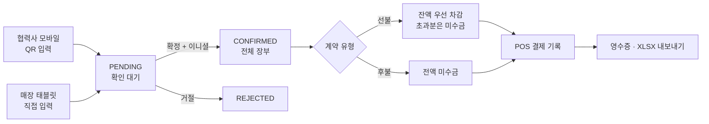
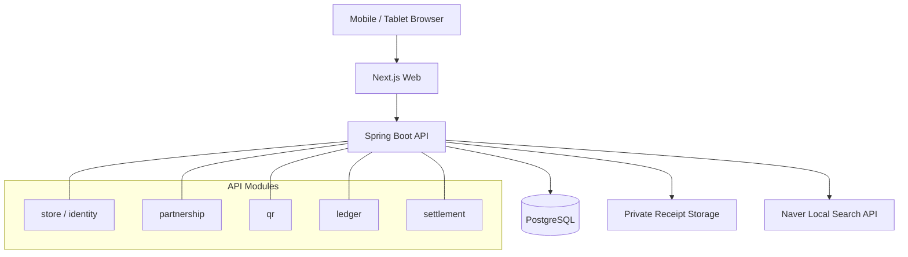

# TIEAT

> QR 입력부터 매장 확인, 장부와 정산 기록까지 한 흐름으로 연결하는 식대 관리 웹 애플리케이션


[프로젝트 페이지](https://tieat.paranglabs.com) · Responsive Web · Installable PWA

TIEAT은 매장과 협력사 사이에서 수기로 관리하던 식대 사용 내역을 디지털 장부로 전환한 프로젝트입니다. 협력사 직원은 별도 앱 없이 매장의 QR을 휴대폰으로 열어 이름과 금액을 입력하고, 매장 직원은 태블릿이나 모바일 화면에서 요청을 확인합니다. 확정된 내역은 장부와 미수금 계산에 반영되며 실제 POS 결제 결과도 별도로 기록할 수 있습니다.

TIEAT은 결제, 충전, 송금을 수행하거나 고객 자금을 보관하는 서비스가 아닙니다. 외부 POS에서 완료된 결제 사실을 장부에 기록하고 대조하는 역할에 집중합니다.

## 해결하려는 문제

식대 거래는 입력하는 사람과 확정하는 사람이 다르고, 선불과 후불 계약이 섞이며, 월말에는 다시 장부를 대조해야 합니다. TIEAT은 이 과정을 다음 원칙으로 정리했습니다.

- 협력사 직원의 입력과 매장 직원의 확정을 분리합니다.
- 모든 거래는 `PENDING` 상태를 거쳐야 장부에 반영됩니다.
- 선불 잔액을 먼저 차감하고 부족한 금액만 미수금으로 계산합니다.
- POS 결제 기록은 금전 이동 명령이 아닌, 이미 완료된 결제에 대한 증빙으로 보관합니다.
- 매장과 협력사 계약을 모든 조회와 변경의 경계로 사용합니다.



## 주요 기능

| 영역 | 제공 기능 |
| --- | --- |
| 매장 가입 | 매장 검색, 초대 코드 기반 가입, 첫 협력사 등록 또는 나중에 추가 |
| 협력사 관리 | 단체·개인 구분, 선불·후불 계약, 초기 선불 잔액, QR 노출 여부, 결제 조건 변경, 보관 처리 |
| QR 식대 입력 | 모바일 공개 입력, 협력사 선택, 요청 상태 확인과 취소, QR 갱신·일시 중지 |
| 확인 대기 | 들어온 요청 자동 갱신, 상세 확인, 직원 이니셜 확정, 거절 |
| 전체 장부 | 기간·협력사 필터, 결제 상태 확인, 모바일 최적화, 페이지 단위 선택 |
| 정산 기록 | 미수금 묶음 선택, POS 영업일과 결제 총액 기록, 중복 요청 방지 |
| 증빙과 내보내기 | 비공개 영수증 이미지 보관·조회, 기간별 장부 및 누적 정산 XLSX 다운로드 |
| 설치형 경험 | 앱 이름과 아이콘을 갖춘 PWA 설치 지원, 매장 장부 화면으로 바로 진입 |

PWA는 현재 설치 가능한 웹 앱 경험에 초점을 맞춥니다. 서비스 워커 기반 오프라인 사용과 푸시 알림은 제공하지 않으므로 장부 사용에는 네트워크 연결이 필요합니다.

## 제품과 구현에서 고려한 점

### 역할이 다른 두 화면

협력사 직원은 휴대폰으로 짧게 입력하고, 매장 직원은 태블릿에서 여러 요청을 빠르게 판단합니다. 공개 QR 화면은 입력 항목을 최소화하고, 매장 화면은 협력사·시간·금액·확인 상태의 정보 우선순위를 유지하면서 320px 폭까지 줄바꿈되도록 구성했습니다.

### 상태 전이로 장부의 신뢰성 확보

사용 요청과 확정 장부를 같은 상태처럼 다루지 않습니다. `PENDING → CONFIRMED` 전이를 도메인 규칙으로 제한하고, 확정자 이니셜과 시각을 함께 남깁니다. 이미 처리된 요청의 재확정과 계약 범위를 벗어난 변경은 서버에서 차단합니다.

### 금액 계산과 동시성

금액은 부동소수점 대신 정수 원 단위로 저장합니다. 선불 계약은 확정 시점의 잔액을 기준으로 선불 적용액과 미수금을 원자적으로 계산하며, 행 잠금과 낙관적 버전 검사를 사용해 동시에 들어온 확정이 잔액을 중복 차감하지 않도록 했습니다.

### 재시도 가능한 쓰기 요청

모바일 네트워크의 지연이나 응답 유실을 고려해 공개 QR 입력, 협력사 등록, POS 정산 기록에 idempotency key와 요청 스냅샷 검증을 적용했습니다. 같은 요청의 안전한 재시도와 서로 다른 내용의 key 재사용을 구분합니다.

### 변경 이후에도 읽을 수 있는 기록

협력사명과 고객 이름은 거래 시점의 스냅샷으로 남겨 이후 계약 정보가 바뀌어도 과거 장부의 의미를 유지합니다. 고객 이름에는 별도 익명화 작업을 두고, 영수증에는 만료와 삭제 상태를 둬 업무 기록과 개인정보의 보관 주기를 분리했습니다.

## 아키텍처

백엔드는 하나의 배포 단위를 유지하는 modular monolith입니다. 업무 규칙은 Spring과 JPA에 의존하지 않는 domain package에 두고, application use case와 adapter가 HTTP, 데이터베이스, 외부 저장소를 연결합니다. 초기 제품에서 운영 복잡도를 억제하면서도 도메인 경계를 코드에 남기기 위한 선택입니다.



```text
apps/
├── api/                         # Spring Boot API
│   └── src/main/java/com/tieat
│       ├── store, identity      # 매장과 세션 인증
│       ├── partnership          # 협력사와 식대 계약
│       ├── qr                   # 공개 QR 수명 주기
│       ├── ledger               # 사용 요청과 확정 장부
│       └── settlement           # POS 정산과 영수증
└── web/                         # Next.js App Router UI
    ├── app/                     # 공개 QR, 가입, 매장 작업 공간
    └── lib/                     # API client와 응답 검증

infra/azure/                     # Azure Bicep 배포 구성
```

## 기술 스택

| 구분 | 기술 |
| --- | --- |
| Frontend | Next.js 16, React 19, TypeScript, Tailwind CSS 4 |
| Backend | Java 25, Spring Boot 4.1, Spring MVC, Spring Security, Spring Data JPA |
| Data | PostgreSQL, Flyway, Spring Session JDBC |
| Storage / Export | Azure Blob Storage, Apache POI |
| Test | JUnit 5, Testcontainers, Vitest, Testing Library |
| Infrastructure | Docker, Azure Container Apps, Key Vault, Managed Identity, Bicep |

## 보안과 개인정보 보호

보안은 UI 검증에 맡기지 않고 요청 경계, 저장소 경계, 운영 경계에 나누어 적용했습니다.

- **인증과 세션**: BCrypt 비밀번호 해시, 서버 측 JDBC 세션, 로그인 시 session ID 교체, `HttpOnly`·`SameSite=Lax` 쿠키를 사용합니다. 운영 쿠키는 HTTPS에서만 전송됩니다.
- **인가와 테넌트 격리**: 매장 전용 API는 역할 인증을 요구하고, 서버가 세션의 `storeId`를 기준으로 데이터 범위를 결정합니다. 클라이언트가 보낸 매장 식별자를 신뢰하지 않습니다.
- **CSRF 방어**: 인증 상태를 변경하는 요청에는 세션 기반 CSRF token을 요구합니다. 공개 QR 요청은 세션 인증과 분리된 제한된 경로로만 허용합니다.
- **민감 작업 재인증**: 협력사 보관 등 영향이 큰 작업은 공용 PIN과 최근 비밀번호 인증을 결합하고 실패 횟수를 제한합니다.
- **남용 방지**: 로그인, 가입, 초대 코드, 공개 QR 생성에 IP·계정·QR client 단위 rate limit을 적용하며 여러 API 인스턴스가 PostgreSQL 상태를 공유합니다.
- **QR token 보호**: 조회에는 SHA-256 digest를 사용하고, 운영에서 원본 token은 versioned AES-256-GCM key로 암호화합니다. QR은 만료·갱신·폐기·신규 요청 일시 중지를 지원합니다.
- **응답과 로그 최소화**: 장부 API는 `no-store`로 요청하고, 공개 QR 페이지는 검색 엔진 노출과 캐시를 막습니다. Web 로그에서 QR 경로의 token, query, fragment를 마스킹합니다.
- **브라우저 방어선**: 운영 응답에 CSP, HSTS, frame 차단, MIME sniffing 방지, referrer 및 permissions 정책을 적용합니다.
- **파일 업로드 검증**: 영수증은 허용된 JPG·PNG만 받고 확장자, media type, 파일 signature, 정상 종료, 실제 이미지 디코딩, 크기와 픽셀 수를 함께 검증합니다. 파일은 공개 URL이 아닌 비공개 저장소에 둡니다.
- **비밀값 관리**: 배포 환경의 DB 자격 증명, QR 암호화 key, 초대 코드, 외부 API secret은 저장소에 두지 않고 Key Vault 참조와 Managed Identity로 주입합니다.
- **데이터 수명 주기**: 고객 이름 익명화와 만료 영수증 삭제를 web 요청과 분리된 작업으로 실행할 수 있으며 처리 결과는 감사 기록으로 남깁니다.

이 항목들은 현재 저장소에서 구현한 방어선의 설명이며 보안 감사를 대체하지 않습니다. 운영 전에는 실제 네트워크 경로, Key Vault 권한, 백업·복구, 로그 유출 여부를 배포 환경에서 다시 검증해야 합니다.

## 로컬 실행

### 요구 사항

- Java 25
- Node.js 22
- Docker와 Docker Compose

PostgreSQL을 실행한 뒤 API와 Web을 각각 시작합니다.

```bash
docker compose up -d postgres
./gradlew :apps:api:bootRun --args='--spring.profiles.active=local'
```

다른 터미널에서:

```bash
cd apps/web
npm ci
npm run dev
```

- Web: `http://localhost:3000`
- API: `http://localhost:8080`
- Health: `http://localhost:8080/actuator/health`

매장 검색과 가입 흐름을 로컬에서 사용하려면 별도의 Naver API 자격 증명과 초대 코드를 환경변수로 설정해야 합니다. QR token 암호화 key를 포함한 모든 비밀값은 `.env` 또는 운영 secret store에서 관리하고 커밋하지 않습니다.

## 검증

Backend unit·integration test:

```bash
./gradlew :apps:api:check --no-daemon
```

PostgreSQL integration test에는 Docker가 필요합니다.

Frontend test와 production build:

```bash
cd apps/web
npm test
TIEAT_API_ORIGIN=https://api.example.com npm run build
```

배포 이미지는 non-root distroless runtime을 사용하고 base image를 digest로 고정합니다. Azure 구성은 외부 Web ingress, 내부 API ingress, private PostgreSQL과 Blob Storage, 최소 권한 Managed Identity를 전제로 하며 변경 전 `validate`와 `what-if` 검토를 거칩니다.
